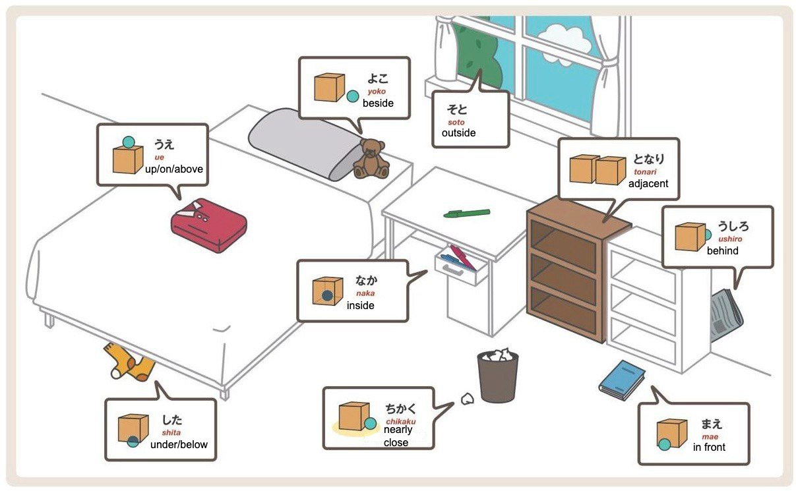

# Positional Indicators in the Japanese Language

In Japanese, words that indicate the location of objects are called **positional indicators**. They are used with the particle **の** (no) to specify the location relative to an object.

!

## Main Positional Indicators

1. **上（うえ）** — up, on, above.  
   - Example: 机の上 (つくえのうえ) — on the table.

2. **下（した）** — down, under, below.  
   - Example: ベッドの下 (ベッドのした) — under the bed.

3. **中（なか）** — inside.  
   - Example: 箱の中 (はこのなか) — inside the box.

4. **外（そと）** — outside, beyond.  
   - Example: 家の外 (いえのそと) — outside the house.

5. **前（まえ）** — in front.  
   - Example: 学校の前 (がっこうのまえ) — in front of the school.

6. **後ろ（うしろ）** — behind.  
   - Example: 車の後ろ (くるまのうしろ) — behind the car.

7. **隣（となり）** — next to, adjacent (for similar objects).  
   - Example: 私の隣 (わたしのとなり) — next to me.

8. **近く（ちかく）** — nearby, close.  
   - Example: 駅の近く (えきのちかく) — near the station.

9. **間（あいだ）** — between.  
   - Example: 木と木の間 (きときのあいだ) — between the trees.

10. **横（よこ）** — beside, on the side.  
    - Example: 車の横 (くるまのよこ) — beside the car.