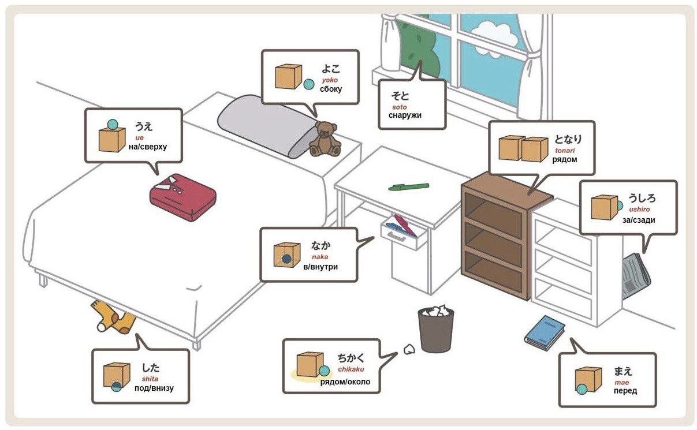

# Позиційні вказівники в японській мові

В японській мові слова, які вказують на розташування об'єктів, називаються **позиційними вказівниками**. Вони використовуються з часткою **の** (но) для прив'язки до об'єкта, відносно якого визначається положення.

!

## Основні позиційні вказівники

1. **上（うえ, уе）** — зверху, на, над.
   - Приклад: 机の上 (つくえのうえ, цукуе но уе) — на столі.

2. **下（した, сіта）** — знизу, під.
   - Приклад: ベッドの下 (ベッドのした, беддо но сіта) — під ліжком.

3. **中（なか, нака）** — всередині.
   - Приклад: 箱の中 (はこのなか, хако но нака) — всередині коробки.

4. **外（そと, сото）** — зовні, поза.
   - Приклад: 家の外 (いえのそと, іе но сото) — зовні будинку.

5. **前（まえ, мае）** — перед.
   - Приклад: 学校の前 (がっこうのまえ, гакко: но мае) — перед школою.

6. **後ろ（うしろ, усіро）** — позаду.
   - Приклад: 車の後ろ (くるまのうしろ, курума но усіро) — позаду машини.

7. **隣（となり, тонарі）** — поруч, по сусідству (про схожі об'єкти).
   - Приклад: 私の隣 (わたしのとなり, ватасі но тонарі) — поруч зі мною.

8. **近く（ちかく, тікаку）** — поблизу.
   - Приклад: 駅の近く (えきのちかく, екі но тікаку) — поруч із вокзалом.

9. **間（あいだ, айда）** — між.
   - Приклад: 木と木の間 (きときのあいだ, кі то кі но айда) — між деревами.

10. **横（よこ, йоко）** — збоку, по боках.  
    - Приклад: 車の横 (くるまのよこ, курума но йоко) — збоку від машини.
